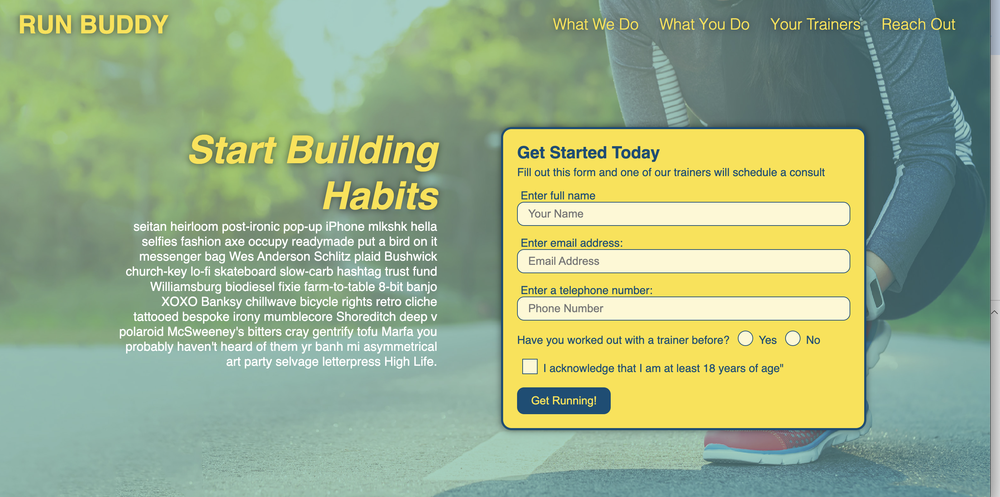

# Run Buddy

### User Story

As a company who focuses on training, we have multiple trainers. I would like a website that will let people know who we are, who are trainers are, and how to contact us. When I am on the homepage, I am presented with a navigation bar where I can navigate to see what we do as a company, what a user needs to do to sign up, our trainers, and a form to contactus.

### Features
This webpage provides a section about what the company does.
This webpage provides a section for what a client needs to do.
This website provides a link to the trainers section and who they are
This website provides a contact form
This website provides a google maps location

### badges

## Table of Contents

- [installation](#installation)
- [contribution guidelines](#contribution)
- [Test Instructions](#testing)
- [License](#license)
- [Questions](#questions)

### Installation
Installation: 
Clone Repository
git clone https://github.com/Vinyldude8896/run-buddy
 
#### Install Dependencies
There are no install dependecies for this project

#### run the program
Right click the index.html file and view in live server.

### Contribution Guidelines
N/A as of yet
### Testing
To test this app:
1. Clone the repo here : https://github.com/Vinyldude8896/run-buddy
2. Open the index.html file using live server

### Questions
    email address : kevinnivek@me.com
    - additional instructions 
    I can be contacted by phone as well, but prefer email contact first.

### Images of example readme.md

## Contribution
Made with ❤️ by Kevin Reid

### ©️2019 Run Buddy, Inc 
